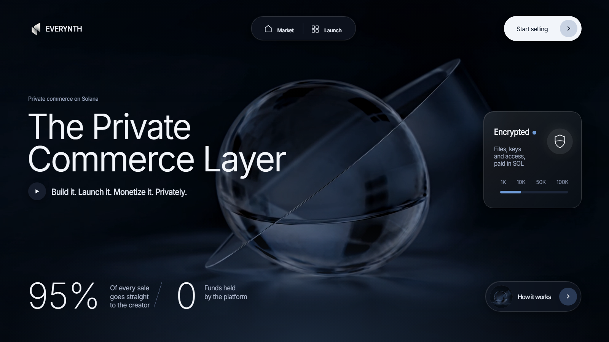
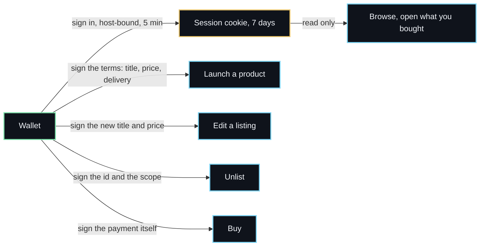
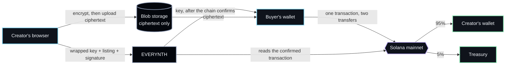
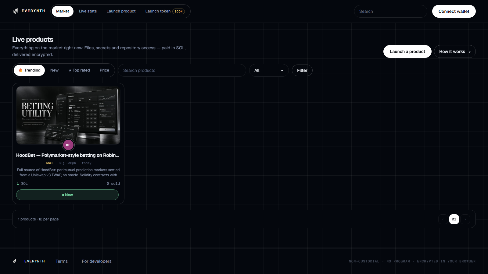

<div align="center">

<a href="https://everynth.org"></a>

# EVERYNTH

**Build it. Launch it. Monetize it. Privately.**

A marketplace on Solana for digital products. The content is encrypted in the creator's browser,<br>
the buyer pays the creator's wallet directly, and the platform holds neither the money nor the goods.

<a href="https://github.com/everynth/everynth/actions/workflows/ci.yml"></a>
<a href="https://github.com/everynth/everynth/actions/workflows/codeql.yml"></a>
<a href="https://scorecard.dev/viewer/?uri=github.com/everynth/everynth"></a>
<a href="#no-contract-to-trust"></a>
<a href="#no-contract-to-trust"></a>
<a href="#the-checks"></a>
<a href="https://everynth.org/docs/payments"></a>
<a href="LICENSE"></a>

[Website](https://everynth.org) · [Market](https://app.everynth.org) · [Docs](https://everynth.org/docs) · [Launch a product](https://everynth.org/docs/tutorial/launch-product) · [API](https://everynth.org/docs/api) · [Security policy](SECURITY.md)

</div>

<br>

## Security first

A marketplace is two promises: that the money goes where it should, and that the goods reach only
the person who paid. EVERYNTH keeps both by never being in a position to break them.

> [!NOTE]
> Running on Solana **mainnet** with real SOL. One honest limit is documented rather than hidden:
> the server can unwrap a content key. See [the honest limit](#the-honest-limit).

### No contract to trust

A purchase is one ordinary Solana transaction containing two plain transfers. There is no program
of ours in the path, so there is nothing to pause, upgrade, drain or rug.

| Guarantee | Why it holds |
|---|---|
| **No&nbsp;custody** | The buyer's wallet pays the creator's wallet. The platform is never a party to the transfer; it reads the chain afterwards and writes a row. |
| **No&nbsp;program** | Two `SystemProgram.transfer` instructions. No escrow account, no PDA, no admin key, nothing upgradeable. |
| **Frozen&nbsp;terms** | The payout split is fixed when the order is created and checked against the confirmed transaction. A price change mid-purchase cannot move what was agreed. |
| **One&nbsp;transaction,&nbsp;one&nbsp;purchase** | The signature is stored under a unique constraint, so the same transaction can never settle a second purchase. |
| **Nothing&nbsp;to&nbsp;withdraw** | A creator's earnings are already in their wallet when the page refreshes. There is no balance, no payout schedule and no withdrawal to be blocked. |

### Signatures, not sessions

Signing in proves an address is yours. It does not authorise anything else: every action that
changes what a buyer sees is signed again, over the exact values involved.



A stolen session cookie can read. It cannot list anything under your address, reprice your work or
empty your shop, because the server rebuilds each message from what was actually submitted and
checks it against your wallet. Change one character after signing and the request is refused.

### Encryption

| Stage | Where it happens |
|---|---|
| **Key** | Generated in the creator's browser. AES-256-GCM, 256-bit, never reused. |
| **Encrypt** | In the browser, before anything is uploaded. Plaintext never leaves the tab. |
| **Store** | Blob storage holds ciphertext only. A leaked storage URL is a leaked blob of noise. |
| **Deliver** | The key is released only after the chain confirms the payment, and the buyer's browser decrypts locally. |

### The honest limit

The content key is stored wrapped with a server-side master key, so EVERYNTH *can* unwrap it. That
is what lets a purchase be delivered while the creator is asleep, and what lets a reported product
be inspected before a takedown. It is written down rather than glossed over, in
[Encryption](https://everynth.org/docs/encryption#honest-limit). Fully end-to-end keys are the
goal, and they cost the offline delivery that makes the market work today.

### The checks

Every claim above is a test, not a sentence in a README.

| Claim | Where it is checked |
|---|---|
| **Payment verification** | The server fetches the confirmed transaction and reads the lamport deltas: right amounts, right recipients, right reference, not already used. Underpaid, failed, foreign and invented transactions are all refused in [`scripts/e2e.mjs`](scripts/e2e.mjs). |
| **No double charge** | A buyer who paid but closed the tab is recovered from the chain by reference, never charged twice. Covered end to end. |
| **Signature discipline** | [`lib/auth.test.ts`](lib/auth.test.ts) proves a login signature cannot pass as a launch confirmation, that every field of the terms is covered, and that a five-minute-old signature is dead. |
| **Encryption round trip** | A 300 KB file is encrypted, uploaded, bought, fetched from storage and decrypted byte for byte in the end-to-end run. |
| **Access control** | Strangers cannot fetch content, review someone else's purchase, edit a listing or unlist a product. Each refusal is its own assertion. |
| **Abuse limits** | One wallet floods itself out of an endpoint while another carries on, verified in the same run. |
| **Code scanning** | CodeQL's `security-extended` queries run on every push and weekly. |
| **Pinned actions** | Every GitHub action is pinned by commit SHA, not by a movable tag. |
| **Independent score** | The [OpenSSF Scorecard](https://scorecard.dev/viewer/?uri=github.com/everynth/everynth) is recomputed and published on every push. |

Found a vulnerability? Report it privately through
[a security advisory](https://github.com/everynth/everynth/security/advisories/new), not in a
public issue. [SECURITY.md](SECURITY.md) has the scope and the response times.

## What it is

| Part | What it does |
|---|---|
| **Launch** | A creator lists a file, a secret, or access to a private GitHub repository, priced in SOL from 0.02 up. Listing is free. |
| **Market** | Products are live the moment the request succeeds. No approval queue, no listing fee, no waiting room. |
| **Buy** | One transaction, two transfers: 95% to the creator, 5% to the treasury. No refunds, because nothing is held to refund. |
| **Deliver** | The buyer's browser decrypts on their own device. GitHub products invite the buyer as a read-only collaborator instead. |
| **Review** | Only a wallet whose purchase is paid can review, and one purchase holds exactly one review, forever. Reviews cannot be bought, farmed or deleted by the seller. |
| **Gate your own app** | `GET /api/verify` answers whether a wallet owns a product, CORS open, so a creator's own app can check entitlement. |

## How it works



1. **Launch.** The browser generates a key, encrypts the payload, uploads the ciphertext, and the
   wallet signs the terms: title, price in lamports, delivery kind. The server re-checks that
   signature before writing anything.
2. **Order.** Pressing Buy freezes the payout split and mints a unique reference key for this
   purchase.
3. **Pay.** One transaction carries both transfers plus the reference. The reference makes the
   payment findable on chain even if the browser dies.
4. **Settle.** The server fetches the confirmed transaction and checks the balances that actually
   moved. Nothing the browser says is trusted.
5. **Open.** The key is released, the ciphertext comes from storage, and the buyer's browser
   decrypts locally.

### Try it

```sh
git clone https://github.com/everynth/everynth.git
cd everynth
npm ci
cp .env.example .env.local
npm run dev
```

With no `DATABASE_URL` the app opens an embedded Postgres under `./data` and creates its own
schema, so the market, the launch console and the docs run against a throwaway database with
nothing else installed. [CONTRIBUTING.md](CONTRIBUTING.md) has the full setup and the
end-to-end suite.

## Live



| What | Where |
|---|---|
| Landing page and docs | [everynth.org](https://everynth.org) |
| The market itself | [app.everynth.org](https://app.everynth.org) |
| Ownership check | `GET https://everynth.org/api/verify?product=<id>&wallet=<address>` |

| Number | Value |
|---|---|
| Network | Solana mainnet |
| Payment | native SOL · 2 transfers · 1 transaction |
| Fee | 5% flat, out of the creator's share |
| Minimum price | 0.02 SOL, so the fee clears rent-exemption |
| Files | up to 200 MB, encrypted before upload |
| Secret text | up to 64 KB |
| Refunds | none — delivery is instant |

## Status

| Phase | Scope | State |
|---|---|---|
| 1&nbsp;·&nbsp;Market | Launch, buy, encrypted delivery, GitHub access, reviews, moderation, ownership check | Live on mainnet |
| 2&nbsp;·&nbsp;Trust | Signed listings, rate limits, reports and takedowns, verified-buyer reviews | Live |
| 3&nbsp;·&nbsp;Private layer | Buyer-to-creator chat, end-to-end keys, escrow and disputes | Planned, needs an audit before it touches money |
| 4&nbsp;·&nbsp;Launchpad | A token for a utility that already works — from the market, or uploaded to it | [Announced, not built](https://app.everynth.org/launchpad) |

## Repository

```
app/
  (app)/          the market: launch console, product pages, stats, dashboard, launchpad
  docs/           documentation and tutorials, with its own chrome
  api/            session, products, orders, purchases, reviews, reports, verify
lib/              payments, signatures, encryption, key wrapping, database, rate limits
components/       wallet, sign-in, product cards, reviews, tutorial player
scripts/e2e.mjs   the end-to-end suite: stub RPC, stub GitHub, real everything else
public/           landing page, logo, social card
.github/          CI, CodeQL, Scorecard, dependency updates
```

## Documentation

| Start | Using it | How it works | Developers |
|---|---|---|---|
| [Overview](https://everynth.org/docs/overview) | [Selling](https://everynth.org/docs/selling) | [Payments](https://everynth.org/docs/payments) | [Ownership check](https://everynth.org/docs/ownership-check) |
| [Getting started](https://everynth.org/docs/getting-started) | [Buying](https://everynth.org/docs/buying) | [Encryption](https://everynth.org/docs/encryption) | [API reference](https://everynth.org/docs/api) |
| [FAQ](https://everynth.org/docs/faq) | [GitHub access](https://everynth.org/docs/github-access) | [Architecture](https://everynth.org/docs/architecture) | [Running it yourself](https://everynth.org/docs/self-hosting) |
| [Tutorials](https://everynth.org/docs/tutorial/launch-product) | [Moderation](https://everynth.org/docs/moderation) | | |

Every page has a permanent URL and every heading has a permalink.

## Contributing

Issues and pull requests are welcome. Read [CONTRIBUTING.md](CONTRIBUTING.md) first. Security
issues go through [SECURITY.md](SECURITY.md), never a public issue.

## License

Licensed under the [Apache License, Version 2.0](LICENSE).
